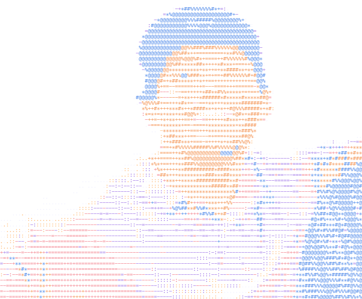

# Hey, I'm Alex :)

I'm a junior at Norhteastern studying CS + Math, trying to build something impactful

- Currently working on Datahub's opensource Hackathon to improve and furthere understand 'context managment' of AI: particuarly in the wake of new regulations on AI and consumer privacy

  

